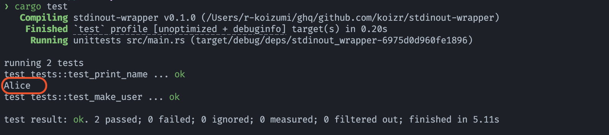
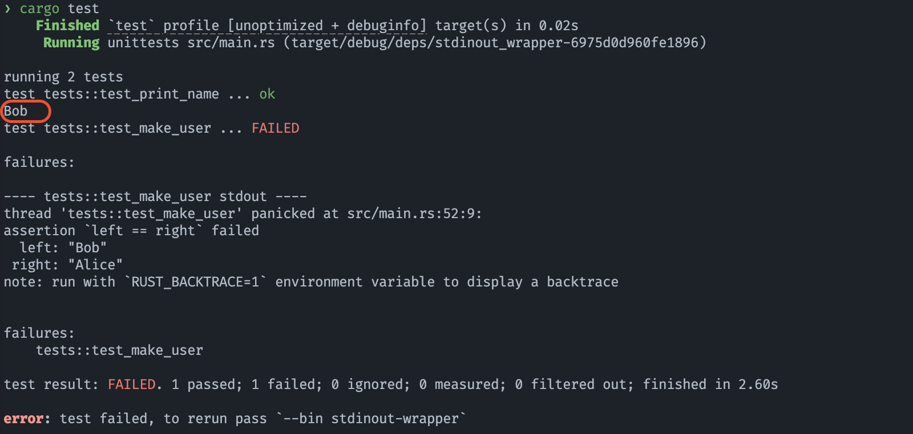

# Rust で標準入出力の抽象化をする

勉強会で紹介したコード例です。

## 内容

`main` ブランチは何の抽象化もせず直接標準入出力を扱うコードになっています。

動作としては、

1. ユーザー名を入力する
1. 入力したユーザー名を持ったユーザーを生成する
1. 生成したユーザーを出力する

という非常に単純なものになっており、次のコマンドで実行すると想定通り動きます。

```sh
cargo run
```

しかし次のコマンドでテストを実行するとどうでしょう？

```sh
cargo test
```

なんと、テスト実行中に停止して入力を待ち受けます。
そしてその入力内容が `Alice` であればテストが成功し、他の文字列であればテストが失敗します。




また、ユーザーを出力する関数のテストではアサーションを書くことができず、意味のないテストコードになっています。

https://github.com/koizr/stdinout-abstract-rs/blob/d2ba875781518672ff4651e6c6e7fe7985d5e020/src/main.rs#L38-L47

## やりたいこと

上記のコードのうち、 [`make_user`](https://github.com/koizr/stdinout-abstract-rs/blob/d2ba875781518672ff4651e6c6e7fe7985d5e020/src/main.rs#L23-L31) 関数と、 [`print_name`](https://github.com/koizr/stdinout-abstract-rs/blob/d2ba875781518672ff4651e6c6e7fe7985d5e020/src/main.rs#L17-L20) 関数を変更し、途中で入力する必要のない、意味のあるテストを書けるようにしましょう。

## 回答例

[標準ライブラリのトレイトを使った抽象化をする #1](https://github.com/koizr/stdinout-abstract-rs/pull/1)
